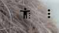
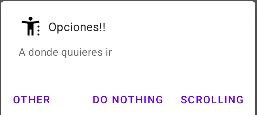
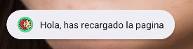
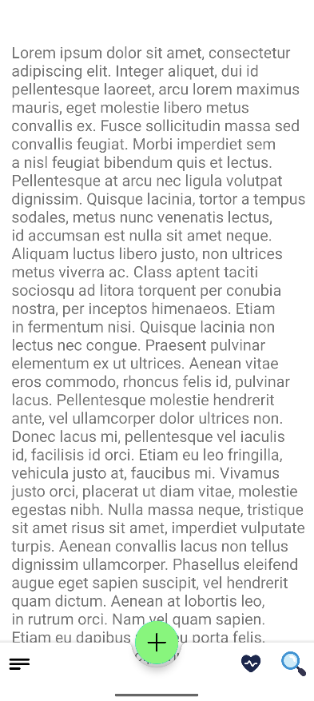
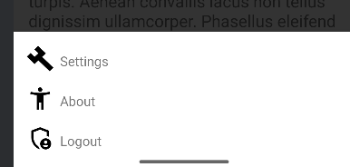
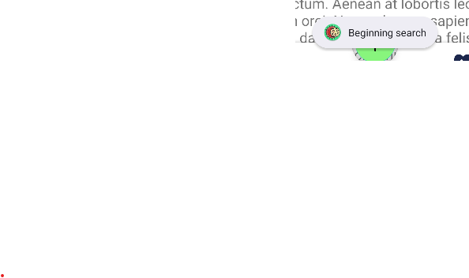
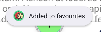
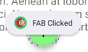

Ejemplos de la vista para aplicacion android:

Vista del main

Opciones que puedes seleccionar en el main:

Y las opciones de settings :

Explorer:

Al recargar la pestaña se vera

La pestaña del Buttom Navigation:

Su menu de opciones:

Boton buscar:

Boton favoritos:

Boton Plus:

"CODIGO MALICIOSO DE XINBO QUE LE HE COLADO A DANI >:D"